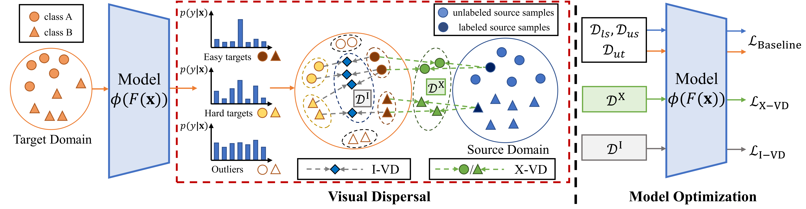
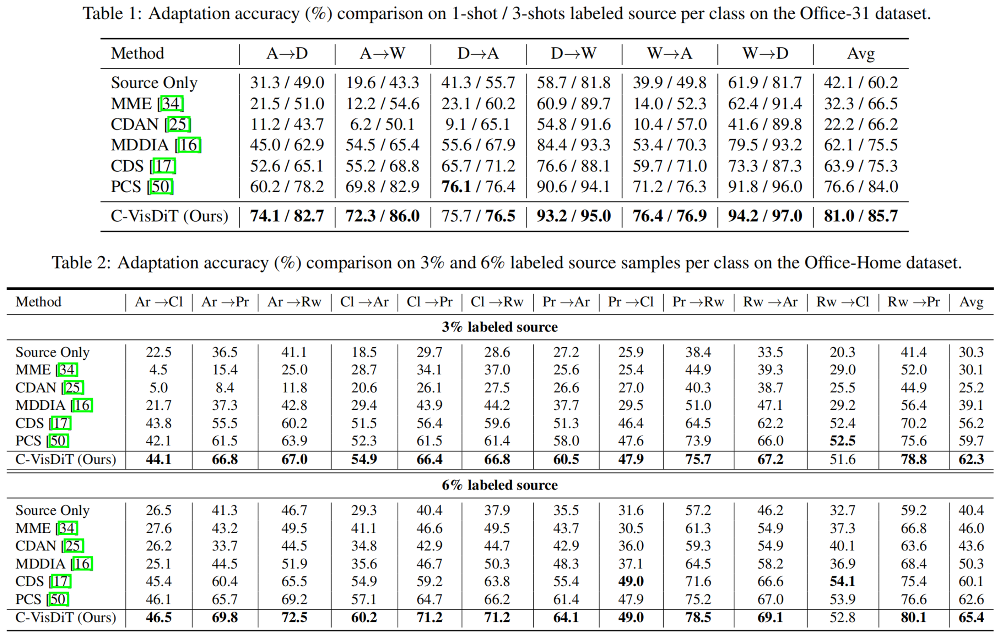
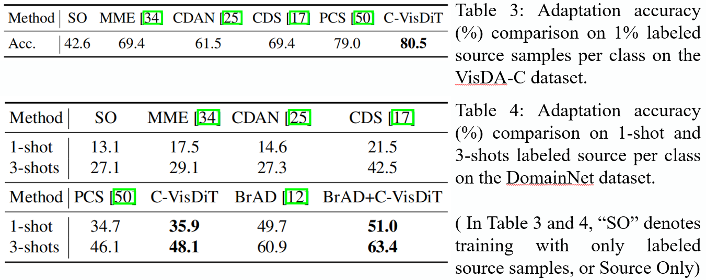

# Confidence-based Visual Dispersal for Few-shot Unsupervised Domain Adaptation (C-VisDiT)

[](https://arxiv.org/pdf/2309.15575.pdf)
[](https://openaccess.thecvf.com/content/ICCV2023/html/Xiong_Confidence-based_Visual_Dispersal_for_Few-shot_Unsupervised_Domain_Adaptation_ICCV_2023_paper.html)


Pytorch implementation of [C-VisDiT](https://openaccess.thecvf.com/content/ICCV2023/html/Xiong_Confidence-based_Visual_Dispersal_for_Few-shot_Unsupervised_Domain_Adaptation_ICCV_2023_paper.html) (**C**onfidence-based **Vis**ual **D**ispersal **T**ransfer)

## Overview



We present the Confidence-based Visual Dispersal Transfer learning method for Few-shot Unsupervised Domain Adaptation, aiming to comprehensively consider the importance of each sample during transfer based on its confidence.

Compared with state-of-the-art methods, PCS improves the mean classification accuracy over different domain pairs on FUDA by **4.4%/1.7%** (1-shot/3-shots labeled source), **2.6%/2.8%** (3\%/6\% labeled source), **1.5%** (1\% labeled source), and **2.0%/2.5%** (1-shot/3-shots labeled source) on Office-31, Office-Home, VisDA-C, and DomainNet, respectively.





## Requirements

```bash
conda create -n cvisdit python=3.7.11
conda activate cvisdit

conda install pytorch==1.8.0 torchvision==0.9.0 torchaudio==0.8.0 cudatoolkit=11.1 -c pytorch -c conda-forge
pip install dotmap faiss-gpu==1.7.0 scikit-learn tensorboard tqdm
```

## Training

- Download the datasets from the Internet (Split files are provided in `data/splits`, we now support Office, Office-Home, VisDA-2017, and DomainNet)
- Soft-link the datasets under the `data` folder (alias for corresponding datasets are `office`, `officehome`, `visda17`, and `domainnet`) 
- To train the model, please refer to `train.sh`. We provide training configurations and SOTA result training-logs in the `./config` and the `./logs` folders. Please note that model performance is not sensitive to hyper parameters added by C-VisDiT (`confidence_params`). These hyper parameters can change in a wide range without greatly affecting the final results.

## Citation

```bibtex
@inproceedings{xiong2023confidence,
  title={Confidence-based Visual Dispersal for Few-shot Unsupervised Domain Adaptation},
  author={Xiong, Yizhe and Chen, Hui and Lin, Zijia and Zhao, Sicheng and Ding, Guiguang},
  booktitle={Proceedings of the IEEE/CVF International Conference on Computer Vision},
  pages={11621--11631},
  year={2023}
}
```

## Acknowlegdement

This code is built on [[PCS](https://github.com/zhengzangw/PCS-FUDA)]. We thank the authors for sharing their code and some of the training configuration files. We reproduced some of the PCS results on our own.

## ToDo's

- Upload training scripts for VisDA-C and BrAD-based DomainNet.
